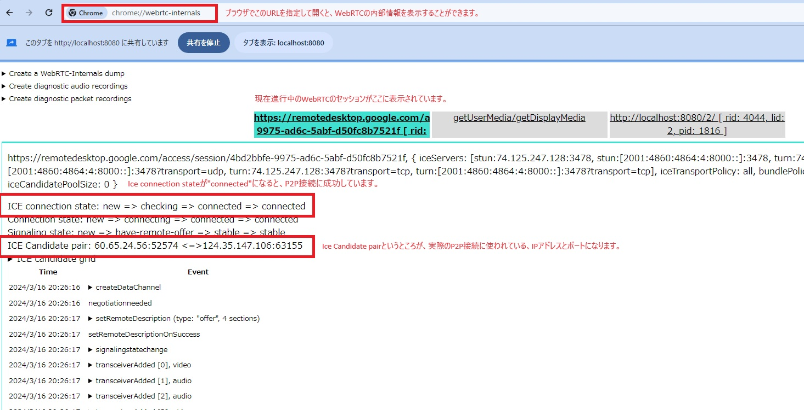

# 学習内容

`createDataChannel`メソッドを使用してデータチャンネルを作成し、データの送受信をする方法を学びました。また、データチャンネルを利用した場合のSDPの変化を確認しました。

WebRTCデータチャンネルで使われているプロトコル、SCTP(Stream Control Transmission Protocol)について学びました。

DTLSのハンドシェイクについて確認しました。（参考：[WebRTC for the Curious 4章](https://webrtcforthecurious.com/ja/docs/04-securing/)）

`onicecandidate`イベントで生成される`ICE Candidate`を読み、`Tricle ICE`と`Vanilla ICE`の違いについて理解しました。

webrtc-internalを読み、WebRTCの内部構造について理解を深めました。

# キーワード
- データチャンネル
- RTP/SRTP
- DTLS
- SCTP(Stream Control Transmission Protocol)
- Ice Candidate
- Trickle/Vanilla ICE

# 理解度チェック

1. Trickle ICEには含まれていないが、Vanilla ICEに含まれる情報は何か。

2. UDPではサポートされていないが、SCTPでサポートされている機能を1つ挙げてください。

3. SCTP(Stream Control Transmission Protocol)の下位レイヤーにあたるプロトコルは何か。